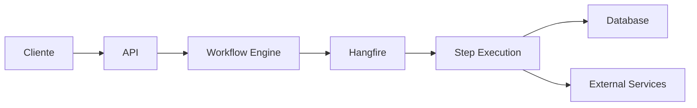

# 🏗️ Resumo da Arquitetura - Sistema de Workflow Engine

## 📋 Visão Geral

O **Workflow Engine** é um sistema completo de orquestração de workflows construído com **.NET 8**, **Entity Framework Core** e **Hangfire**, seguindo os princípios de **Clean Architecture** e implementando os padrões **Strategy** e **Chain of Responsibility**.

## 🎯 Objetivos do Sistema

- ✅ **Workflows Flexíveis**: Etapas reutilizáveis em diferentes workflows
- ✅ **Agendamento Inteligente**: Execução imediata ou agendada (minutos a dias)
- ✅ **Processamento Assíncrono**: Background jobs com Hangfire
- ✅ **Resiliência**: Retry automático e recuperação de falhas
- ✅ **Monitoramento**: Visibilidade completa do estado dos workflows
- ✅ **Controle Total**: Pause, resume e cancel em tempo real

## 🏛️ Arquitetura C4 Model

### Nível 1: Context
```
[Usuários] → [Workflow Engine System] ← [Serviços Externos]
                     ↓
              [Banco de Dados]
```

### Nível 2: Containers
```
┌─────────────────────────────────────────────────────────┐
│                Workflow Engine System                   │
├─────────────────┬─────────────────┬─────────────────────┤
│   Web API       │   Core Engine   │  Background Jobs    │
│  (ASP.NET)      │   (Lógica)      │   (Hangfire)        │
├─────────────────┼─────────────────┼─────────────────────┤
│                 │   Data Layer    │                     │
│                 │ (Entity FW)     │                     │
└─────────────────┴─────────────────┴─────────────────────┘
```

### Nível 3: Components
```
Core Engine:
├── IWorkflowEngine (Interface)
├── WorkflowEngine (Implementação)
├── Step Implementations
│   ├── LogStep
│   ├── EmailStep
│   └── DelayStep
├── Models & Entities
└── Data Context
```

## 🔄 Fluxo de Execução



### Sequência Típica:
1. **Cliente** cria/executa workflow via API
2. **Workflow Engine** persiste execução no banco
3. **Hangfire** agenda processamento em background
4. **Steps** são executadas sequencialmente
5. **Estado** é persistido a cada etapa
6. **Monitoramento** em tempo real via dashboard

## 📊 Modelo de Dados

### Entidades Principais:
- **WorkflowDefinition**: Template do workflow
- **StepDefinition**: Template das etapas
- **WorkflowStep**: Etapas de um workflow específico
- **WorkflowExecution**: Instância de execução
- **StepExecution**: Execução de etapa individual

### Status de Controle:
```
Workflow: Pending → Running → Completed/Failed/Cancelled
Step: Pending → Running → Completed/Failed/Skipped
```

## 🛠️ Tecnologias Utilizadas

| Camada | Tecnologia | Propósito |
|--------|------------|----------|
| **API** | ASP.NET Core 8 | REST endpoints |
| **Core** | .NET 8 | Lógica de negócio |
| **Jobs** | Hangfire | Background processing |
| **Data** | Entity Framework Core | ORM e persistência |
| **Storage** | In-Memory/SQL Server | Armazenamento |
| **Docs** | Swagger/OpenAPI | Documentação API |

## 🔧 Padrões de Design Implementados

### 1. **Strategy Pattern**
```csharp
public interface IWorkflowStep
{
    Task<StepResult> ExecuteAsync(StepContext context);
}

public class EmailStep : IWorkflowStep { }
public class LogStep : IWorkflowStep { }
```

### 2. **Chain of Responsibility**
```
Step 1 → Step 2 → Step 3 → ... → Step N
```

### 3. **Dependency Injection**
```csharp
services.AddScoped<IWorkflowEngine, WorkflowEngine>();
services.AddScoped<EmailStep>();
```

## 📈 Características de Qualidade

### ⚡ **Performance**
- Processamento assíncrono
- Background jobs não-bloqueantes
- Cache inteligente

### 🔄 **Escalabilidade**
- Múltiplas instâncias da API
- Workers distribuídos
- Load balancing

### 🛡️ **Resiliência**
- Retry automático configurável
- Circuit breaker pattern
- Graceful degradation

### 👀 **Observabilidade**
- Hangfire Dashboard
- Structured logging
- Métricas em tempo real

### 🔧 **Manutenibilidade**
- Clean Architecture
- SOLID principles
- Unit testing ready

## 🚀 Deploy e Infraestrutura

### Ambiente de Desenvolvimento:
```
┌─────────────┐    ┌─────────────┐    ┌─────────────┐
│  API (5000) │    │ In-Memory   │    │  Hangfire   │
│             │───▶│  Database   │◀───│  Dashboard  │
│  + Swagger  │    │             │    │   (Web UI)  │
└─────────────┘    └─────────────┘    └─────────────┘
```

### Ambiente de Produção:
```
┌─────────────┐    ┌─────────────┐    ┌─────────────┐
│Load Balancer│───▶│  API Nodes  │───▶│ PostgreSQL  │
└─────────────┘    │ (Multiple)  │    │  Cluster    │
                   └─────────────┘    └─────────────┘
                          │                   ▲
                          ▼                   │
                   ┌─────────────┐           │
                   │ Background  │───────────┘
                   │  Workers    │
                   └─────────────┘
```

## 📊 Métricas e Monitoramento

### KPIs Principais:
- ⏱️ **Tempo médio de execução** por workflow
- 📈 **Taxa de sucesso** vs falhas
- 🔄 **Número de retries** por etapa
- 📊 **Throughput** de workflows por minuto
- 🎯 **SLA compliance** para workflows críticos

### Dashboards:
1. **Hangfire Dashboard**: Jobs e filas
2. **Custom Metrics**: Business intelligence
3. **Health Checks**: Status do sistema

## 🔮 Roadmap Futuro

### Funcionalidades Planejadas:
- [ ] **WorkflowBuilder** visual
- [ ] **Conditional branching** (if/else)
- [ ] **Parallel execution** de etapas
- [ ] **Sub-workflows** aninhados
- [ ] **Event-driven triggers**
- [ ] **GraphQL API**
- [ ] **Workflow templates** marketplace

### Melhorias Técnicas:
- [ ] **Kubernetes** deployment
- [ ] **Distributed tracing**
- [ ] **Advanced caching**
- [ ] **Message queues** (RabbitMQ)
- [ ] **Workflow versioning**

---

**💡 Esta arquitetura foi projetada para ser:**
- 🧩 **Modular**: Fácil de estender
- 🔧 **Configurável**: Adaptável a diferentes cenários
- 📈 **Escalável**: Cresce com a demanda
- 🛡️ **Confiável**: Resistente a falhas
- 👀 **Observável**: Transparente em operação

