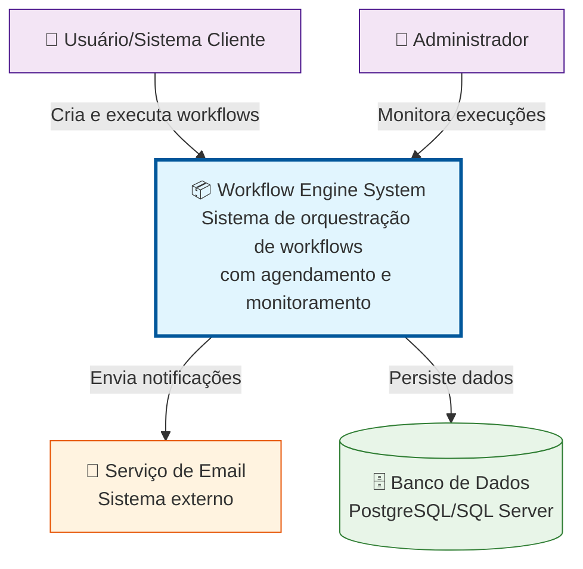
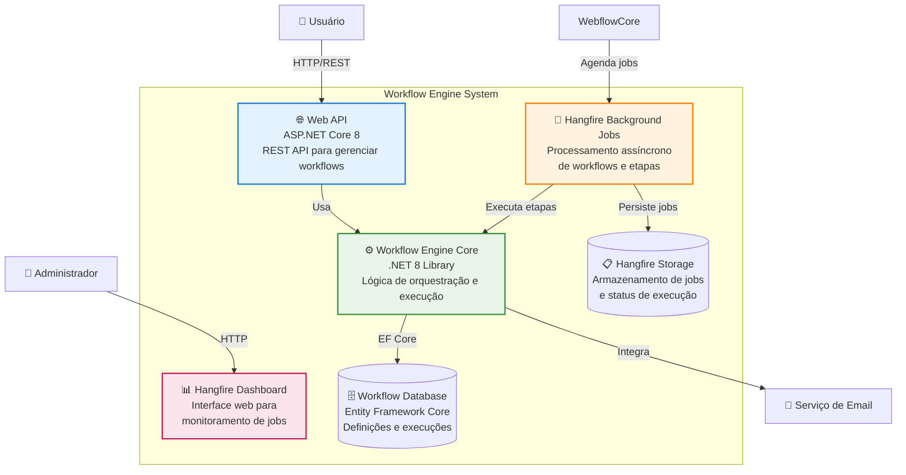
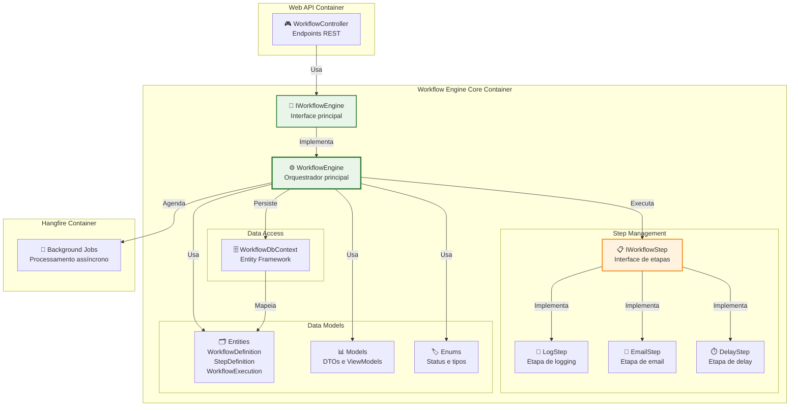
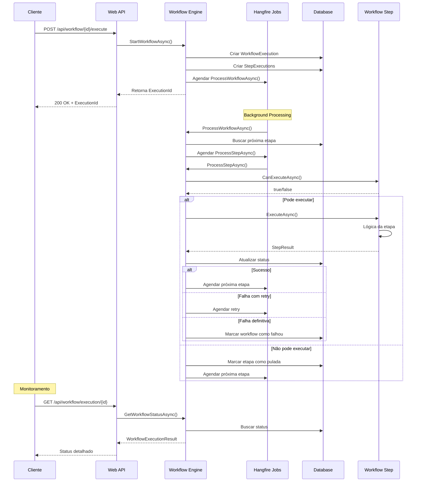
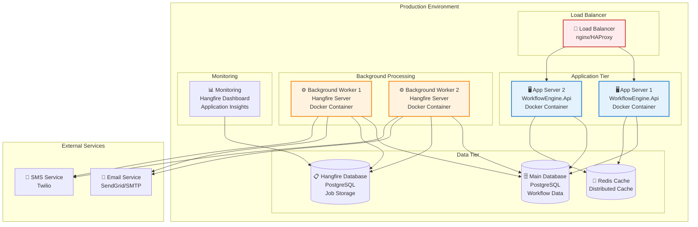

# Diagrama C4 Model - Sistema de Workflow Engine

## 1. Context Diagram (Nível 1)

## 2. Container Diagram (Nível 2)

## 3. Component Diagram (Nível 3) - Workflow Engine Core

## 4. Code Diagram (Nível 4) - Fluxo de Execução

## 5. Deployment Diagram

## Principais Características da Arquitetura

### 🎯 **Separação de Responsabilidades**
- **API Layer**: Exposição de endpoints REST
- **Core Engine**: Lógica de negócio e orquestração
- **Background Processing**: Execução assíncrona via Hangfire
- **Data Layer**: Persistência com Entity Framework

### ⚡ **Escalabilidade**
- **Horizontal**: Múltiplas instâncias da API e workers
- **Vertical**: Otimização de recursos por container
- **Assíncrona**: Processamento não-bloqueante

### 🔄 **Resiliência**
- **Retry automático**: Falhas temporárias são reprocessadas
- **Circuit breaker**: Proteção contra falhas em cascata
- **Monitoring**: Visibilidade completa do sistema

### 🔧 **Extensibilidade**
- **Plugin Architecture**: Novas etapas via IWorkflowStep
- **Strategy Pattern**: Diferentes implementações de etapas
- **Dependency Injection**: Facilita testes e manutenção

### 📊 **Observabilidade**
- **Hangfire Dashboard**: Monitoramento em tempo real
- **Structured Logging**: Logs detalhados para debugging
- **Metrics**: Métricas de performance e uso

